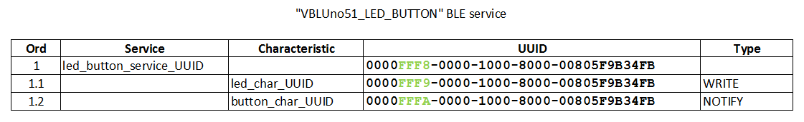
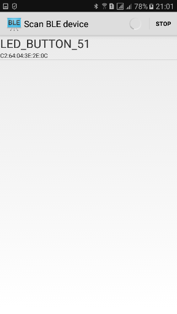
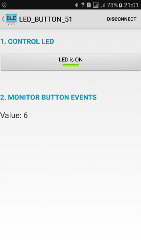

# Control / Monitor a device by Mobile via BLE with the VBLUno51 board of VNG IoT Lab

***
## Function

* Control: Mobile --> VBLUno51 (Write action): Turn LED On/Off
* Monitor: Mobile <-- VBLUno51 (Notify action): When press button on VBLUno51, plus 1 and send to Mobile

***
## Design BLE Service

***
## Firmware for the VBLUno51 board

* Arduino IDE: see `firmware_vbluno51` directory

***
## Android application

* Android Studio: see `android` directory

***
## Demo Image

